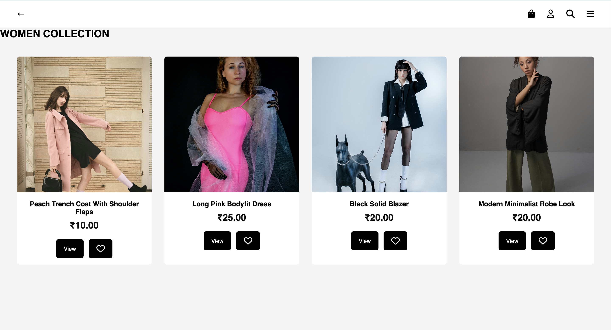
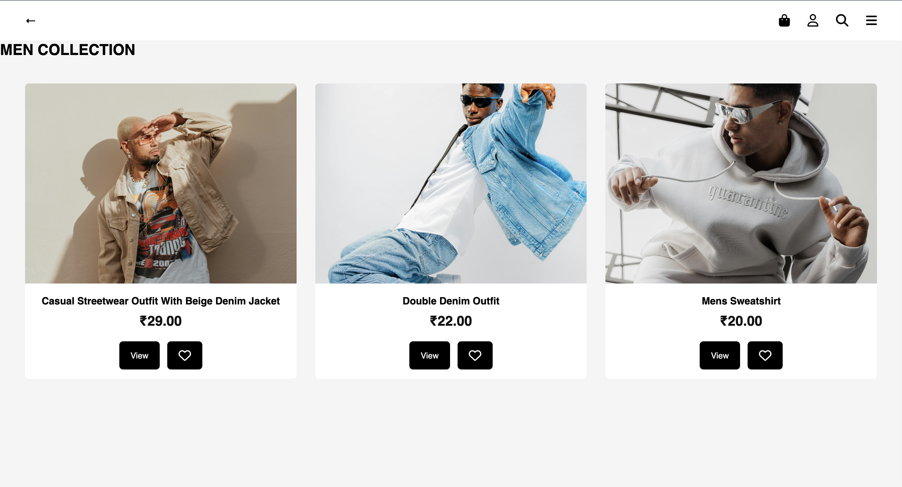
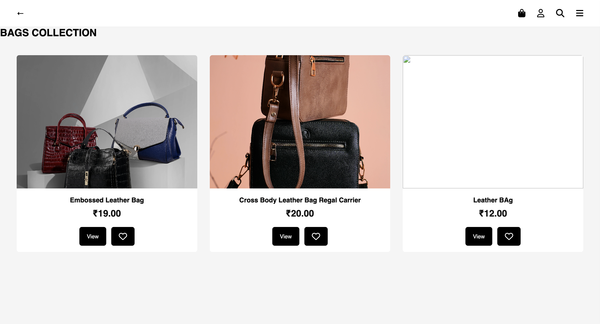

<div align="center">

# 📦 LUCCI Product Service

### Product Catalog Microservice for the LUCCI Cloud Native E-Commerce Platform

<br/>

[](https://nodejs.org/)
[](https://expressjs.com/)
[](https://www.mysql.com/)
[](https://www.docker.com/)
[](https://aws.amazon.com/ecs/)
[](https://aws.amazon.com/ecr/)
[](https://aws.amazon.com/rds/)
[](https://jwt.io/)
[](https://www.jenkins.io/)

<br/>

> Built using **Node.js + Express.js + MySQL**

> Containerized using **Docker**

> Automated deployment using **Jenkins + Amazon ECR + Amazon ECS (Fargate)**

> Manages product catalog operations including product retrieval, category filtering, product creation, and secure administrator access for the LUCCI e-commerce platform.

</div>

---

# ✨ Features

- View all available products
- Retrieve product details by ID
- Filter products by category
- Add new products (Admin only)
- JWT-based authentication
- Role-based administrator authorization
- MySQL database integration
- RESTful API architecture
- Docker containerization
- Automated CI/CD using Jenkins
- Amazon ECR container registry
- Deployment on Amazon ECS (Fargate)
- Amazon RDS MySQL database connectivity
- Secure API endpoints
- Cloud-native microservice architecture

---

# 📑 Table of Contents

- [Project Overview](#-project-overview)
- [Technology Stack](#-technology-stack)
- [Project Structure](#-project-structure)
- [Architecture](#-architecture)
- [Database Configuration](#-database-configuration)
- [Authentication & Authorization](#-authentication--authorization)
- [REST API Endpoints](#-rest-api-endpoints)
- [Docker Configuration](#-docker-configuration)
- [Jenkins CI/CD Pipeline](#-jenkins-cicd-pipeline)
- [AWS Infrastructure](#-aws-infrastructure)
- [Deployment Workflow](#-deployment-workflow)
- [Product Images](#-product-images)
- [Future Improvements](#-future-improvements)
- [Author](#-author)
- [License](#-license)

---

# 📖 Project Overview

The **Product Service** is one of the core backend microservices of the **LUCCI Cloud Native E-Commerce Platform**. It is responsible for managing the product catalog and exposing secure REST APIs that allow users to browse products while enabling administrators to manage inventory.

This service stores product information inside an Amazon RDS MySQL database and provides APIs for retrieving products, filtering them by category, and creating new products. Administrative operations are protected using JWT-based authentication and role-based authorization.

The Product Service is containerized using Docker and deployed on Amazon ECS (Fargate). A Jenkins CI/CD pipeline automatically builds Docker images, pushes them to Amazon ECR, and deploys updated task revisions to ECS.

---

# 💻 Technology Stack

| Category | Technology |
|-----------|------------|
| Runtime | Node.js |
| Framework | Express.js |
| Database | MySQL (Amazon RDS) |
| Authentication | JWT (JSON Web Token) |
| Containerization | Docker |
| CI/CD | Jenkins |
| Container Registry | Amazon ECR |
| Container Orchestration | Amazon ECS (Fargate) |
| Cloud Provider | Amazon Web Services (AWS) |
| Version Control | Git & GitHub |

---

# 📂 Project Structure

```text
product-service/
│
├── assets/
│   ├── Bags.png
│   ├── Jwellery.png
│   ├── Mens.png
│   └── Womens.png
│
├── src/
│   ├── controllers/
│   │   └── product.controller.js
│   │
│   ├── middleware/
│   │   └── auth.middleware.js
│   │
│   ├── routes/
│   │   └── product.routes.js
│   │
│   ├── app.js
│   └── db.js
│
├── Dockerfile
├── Jenkinsfile
├── package.json
├── package-lock.json
└── README.md
```

## 📁 Folder Description

| Folder/File | Purpose |
|-------------|---------|
| **controllers/** | Contains business logic for retrieving, filtering, and creating products. |
| **middleware/** | Implements JWT authentication and administrator authorization. |
| **routes/** | Defines REST API endpoints for product operations. |
| **app.js** | Initializes the Express server, middleware, database connection, and routes. |
| **db.js** | Creates and manages the MySQL connection pool. |
| **Dockerfile** | Builds the Docker image for container deployment. |
| **Jenkinsfile** | Automates build, push, and deployment to Amazon ECS. |
| **package.json** | Defines project metadata, dependencies, and scripts. |
| **assets/** | Contains screenshots demonstrating the Product Service functionality. |

---

# 🏗️ Architecture

The Product Service follows a layered architecture that separates routing, authentication, business logic, and database operations, making the application modular, scalable, and easy to maintain.

```text
                Client
                   │
                   ▼
           Express Application
               (app.js)
                   │
                   ▼
           Product Routes
      (product.routes.js)
                   │
        ┌──────────┴──────────┐
        │                     │
        ▼                     ▼
 JWT Authentication     Public APIs
  verifyToken()
        │
        ▼
Admin Authorization
 verifyAdmin()
        │
        ▼
 Product Controller
(product.controller.js)
        │
        ▼
 Database Layer
      (db.js)
        │
        ▼
 Amazon RDS MySQL
```

## 🔄 Request Flow

1. Client sends an HTTP request to the Product Service.
2. Express receives and routes the request.
3. Public APIs directly access the controller.
4. Protected APIs validate the JWT token.
5. Admin APIs additionally verify the user's administrator role.
6. The controller executes the required business logic.
7. SQL queries are executed through the MySQL connection pool.
8. Results are returned to the client as JSON responses.

This layered architecture keeps the service modular, secure, and easy to extend.

---

# 🗄️ Database Configuration

The Product Service stores all product information in an **Amazon RDS MySQL** database.

Database connectivity is implemented using the **mysql2** package with connection pooling to efficiently manage multiple database requests.

## 📋 Product Information Stored

- Product ID
- Product Name
- Product Price
- Product Image URL
- Product Category

## ⚙️ Database Operations

The Product Service performs the following operations:

- Retrieve all products
- Retrieve a product by ID
- Retrieve products by category
- Insert new products (Admin only)

Connection pooling improves performance by reusing active database connections instead of creating a new connection for every request.

---

# 🔐 Authentication & Authorization

The Product Service secures administrative APIs using **JSON Web Tokens (JWT)** together with **role-based authorization**.

## 🌐 Public APIs

These APIs are accessible without authentication.

- Retrieve all products
- Retrieve product by ID
- Retrieve products by category
- Health check

## 🔒 Protected APIs

The following API requires authentication and administrator privileges.

- Create a new product

## 🔄 Authorization Flow

```text
Client
   │
   ▼
Authorization Header
Bearer <JWT Token>
   │
   ▼
verifyToken()
   │
   ▼
JWT Validation
   │
   ▼
verifyAdmin()
   │
   ▼
Administrator Access Granted
   │
   ▼
Create Product
```

Example Authorization header:

```http
Authorization: Bearer <your_jwt_token>
```

Only authenticated users with the **admin** role can create new products.

---

# 📡 REST API Endpoints

## 🌐 Public APIs

| Method | Endpoint | Description |
|---------|----------|-------------|
| GET | `/products` | Retrieve all products |
| GET | `/products/:id` | Retrieve a product by ID |
| GET | `/products/category/:category` | Retrieve products by category |
| GET | `/products/health` | Product Service health check |
| GET | `/health` | Application health check |

---

## 🔒 Administrator APIs

| Method | Endpoint | Authentication | Description |
|---------|----------|----------------|-------------|
| POST | `/products` | JWT + Admin | Create a new product |

---

## 📥 Sample Request

```http
POST /products
Authorization: Bearer <JWT Token>
Content-Type: application/json
```

```json
{
  "name": "Leather Bag",
  "price": 2499,
  "image_url": "https://your-image-url.com/bag.jpg",
  "category": "bags"
}
```

---

## 📤 Successful Response

```json
{
  "success": true
}
```

---

## ❌ Example Error Response

```json
{
  "error": "Admin only"
}
```

---

# 🐳 Docker Configuration

The Product Service is containerized using Docker to ensure consistent application behavior across development, testing, and production environments.

## 📄 Dockerfile

```dockerfile
FROM node:18-alpine

WORKDIR /app

COPY package*.json ./

RUN npm install --production

COPY . .

EXPOSE 6000

CMD ["node", "src/app.js"]
```

---

## 🏗️ Build Docker Image

```bash
docker build -t product-service .
```

---

## ▶️ Run Docker Container

```bash
docker run -p 6000:6000 product-service
```

The Product Service will be available at:

```
http://localhost:6000
```

---

# 🔄 Jenkins CI/CD Pipeline

The Product Service uses a Jenkins pipeline to automate building, packaging, and deploying the application whenever new code is pushed to the GitHub repository.

## 🚀 Pipeline Stages

1. Checkout Source Code
2. Authenticate with Amazon ECR
3. Build Docker Image
4. Push Docker Image to Amazon ECR
5. Register a New Amazon ECS Task Definition
6. Deploy the Updated Task Definition
7. Clean Up Docker Images

---

## 🔁 CI/CD Workflow

```text
GitHub Repository
        │
        ▼
Jenkins Pipeline
        │
        ▼
Docker Image Build
        │
        ▼
Amazon ECR
        │
        ▼
Amazon ECS (Fargate)
        │
        ▼
Running Product Service
```

---

# ☁️ AWS Infrastructure

The Product Service is deployed using a fully containerized cloud-native architecture on Amazon Web Services.

## ☁️ AWS Services Used

- Amazon ECS (Fargate)
- Amazon Elastic Container Registry (ECR)
- Amazon RDS MySQL
- Application Load Balancer (ALB)
- Jenkins
- GitHub

---

## 🏗️ Infrastructure Architecture

```text
                Developer
                    │
                    ▼
           GitHub Repository
                    │
                    ▼
            Jenkins Pipeline
                    │
                    ▼
           Docker Image Build
                    │
                    ▼
             Amazon ECR
                    │
                    ▼
        Amazon ECS (Fargate)
                    │
                    ▼
      Application Load Balancer
                    │
                    ▼
          Product Service API
                    │
                    ▼
         Amazon RDS MySQL Database
```

This architecture enables automated deployments, scalable container orchestration, secure image management, and highly available database connectivity.

---

# 🚀 Deployment Workflow

Whenever code is pushed to GitHub, the Product Service is automatically deployed using the Jenkins CI/CD pipeline.

## 📋 Deployment Steps

1. Developer pushes code to GitHub.
2. Jenkins automatically detects the new commit.
3. Jenkins builds a new Docker image.
4. The Docker image is pushed to Amazon ECR.
5. Jenkins creates a new Amazon ECS task definition revision.
6. Amazon ECS updates the running service.
7. New containers are started automatically.
8. Application Load Balancer routes traffic to the updated Product Service.
9. The Product Service communicates with Amazon RDS MySQL to serve product requests.

---

## 🔄 Complete Deployment Flow

```text
Developer
    │
    ▼
GitHub
    │
    ▼
Jenkins
    │
    ▼
Docker Build
    │
    ▼
Amazon ECR
    │
    ▼
Amazon ECS (Fargate)
    │
    ▼
Application Load Balancer
    │
    ▼
Product Service
    │
    ▼
Amazon RDS MySQL
```

This deployment process ensures minimal downtime, automated releases, and consistent deployments across environments.

---

# 🖼️ Product Images

The following screenshots demonstrate the Product Service integrated with the LUCCI Cloud Native E-Commerce Platform.

## 👗 Women's Collection



---

## 👔 Men's Collection



---

## 👜 Bags Collection



---

## 💎 Jewellery Collection


---

# 🚀 Future Improvements

The Product Service can be enhanced with additional features to improve scalability, performance, and the overall shopping experience.

- 🔍 Product search by name and keywords.
- 📄 Pagination and sorting for large product catalogs.
- ✏️ Update existing product information.
- 🗑️ Delete products with administrator authorization.
- 📦 Product inventory and stock management.
- ⭐ Product ratings and customer reviews.
- 🖼️ Direct image uploads to Amazon S3 instead of storing image URLs.
- ⚡ Redis caching for faster product retrieval.
- 📑 API documentation using Swagger/OpenAPI.
- 🧪 Unit and integration testing using Jest and Supertest.
- 📊 Monitoring and logging using Amazon CloudWatch.
- 📈 Auto Scaling based on application traffic.

---

# 👨‍💻 Author

<div align="center">

## Rozana IM

**Cloud Engineer • DevOps Engineer • AWS Enthusiast**

GitHub: https://github.com/Rozana-IM

LinkedIn: https://www.linkedin.com/in/rozana-im-a63541302/

</div>

---
# ⭐ Support

If you found this project helpful,

please consider giving it a ⭐ on GitHub.

It really helps and motivates me to build more cloud-native projects.

---

# 📄 License

This project is part of the **LUCCI Cloud Native E-Commerce Platform** and is intended for learning, portfolio, and demonstration purposes.

---

<div align="center">

## ☁️ Built with Node.js • Express.js • MySQL • Docker • Amazon ECS • Amazon ECR • Amazon RDS • Jenkins

### ❤️ Part of the LUCCI Cloud Native E-Commerce Platform

</div>
